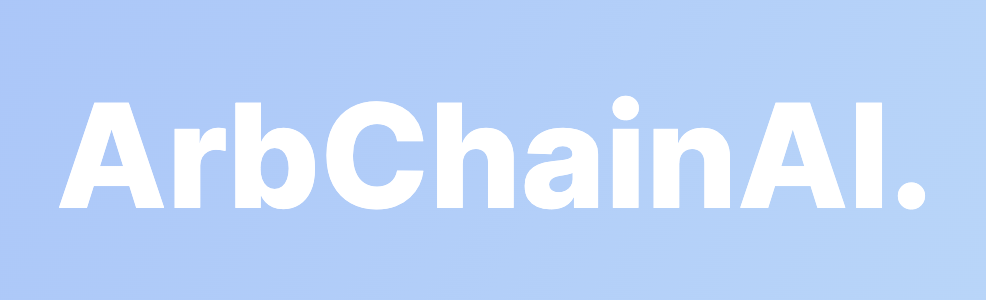

# ArbChain AI

## Overview

ArbChain AI is a revolutionary web-based platform that combines blockchain technology and artificial intelligence to automate the process of legal arbitration. It provides a cost-effective and efficient solution for resolving disputes between parties involved in collaborative business projects. By leveraging trusted third parties and advanced AI algorithms, arbCHAINAI aims to streamline the arbitration process and bring justice to the digital era.

## Key Features

- **Automated Arbitration**: ArbChain AI automates the arbitration process, reducing the reliance on traditional court proceedings and their associated costs and delays.
- **Trusted Third Parties**: The platform utilizes trusted third parties, such as law firms, to mediate and judge disputes impartially.
- **Secure Data Storage**: All evidence, documents, and judgments are securely recorded on the blockchain and IPFS, ensuring transparency, immutability, and tamper-proof integrity.
- **AI-powered Legal Statements**: ArbChain AI's advanced AI algorithms analyze case descriptions and convert them into comprehensive legal statements, aiding the arbitration process.
- **Future Integration of Jury System**: The project envisions the future integration of a diverse jury system, allowing individuals from various backgrounds to participate in the arbitration process.

## Installation

To install and run ArbChain AI locally, please follow these steps:

1. Clone the repository:

git clone  https://github.com/adrian-blockchain/fantom-hackathon-Q2-ArbChainAI.git

2. Install the necessary dependencies:

npm install

3. Configure the environment variables by creating a `.env` file and specifying the required values:
   API_KEY=your_api_key
   SECRET_KEY=your_secret_key

4. Start the application:

npm run dev

5. Access the application in your browser at `http://localhost:3000`.

## Contributing

We welcome contributions from the open source community to enhance ArbChain AI. To contribute, please follow these steps:

1. Fork the repository.
2. Create a new branch for your feature or bug fix.
3. Commit your changes.
4. Push your branch to your forked repository.
5. Submit a pull request to the main ArbChain AI repository.

## License

ArbChain AI is released under the [MIT License](LICENSE).

## Contact

For any inquiries or suggestions, please contact the ArbChain AI team at contact@arbchainai.com.

Join us in revolutionizing legal arbitration with blockchain and AI!

**Note**: This README is a template and should be modified to suit the specific project requirements and details.

